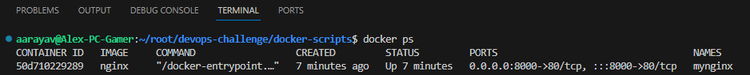
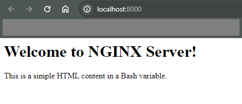
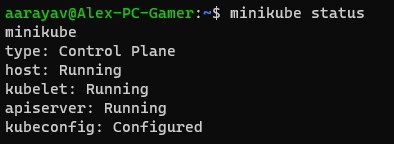
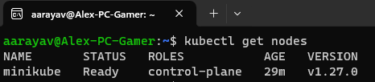

# Technical Challenge
### by Alexander Araya Vega

### 1. Nginx web server to expose files for download
- Prerequisites (Windows WSL - Ubuntu)
    - Install WSL, follow [Microsoft official documentation](https://techcommunity.microsoft.com/t5/windows-11/how-to-install-the-linux-windows-subsystem-in-windows-11/m-p/2701207/page/2)
    - Install Ubuntu OS <18.x.x from [Microsoft Store](https://www.microsoft.com/store/productId/9MTTCL66CPXJ?ocid=pdpshare)
    - In case of Docker manual installation, follow [Docker official documentation](https://docs.docker.com/engine/install/ubuntu/)
    - Install a Text editor, in this case is recommended Visual Studio Code. Follow [official docs](https://code.visualstudio.com/docs/setup/windows)

- Instructions
    - Clone the project locally in Ubuntu machine.
    - Open folder "docker-scripts" and use script ```nginx_setup.sh```
    - Grant execution access to script: ```$ chmod +x nginx_setup.sh```
    - Execution command for the script: ```$ ./nginx_setup.sh nginx```
    - Run the following command and check if the Docker container is running: ```$ docker ps```
     * NOTE: It should display an output like below:
     
    - Open a web browser and access http://localhost:8000 to see Nginx index web page running.
     * NOTE: It should display the following text in browser:
    

### 2. Run Harbor Resitry in Kubernetes cluster
- Prerequisites (Windows WSL - Ubuntu)
    - Install WSL, follow [official documentation](https://techcommunity.microsoft.com/t5/windows-11/how-to-install-the-linux-windows-subsystem-in-windows-11/m-p/2701207/page/2)
    - Install Ubuntu OS <18.x.x from [Microsoft Store](https://www.microsoft.com/store/productId/9MTTCL66CPXJ?ocid=pdpshare)
    - Minikube [installation](https://cursosdedesarrollo.com/2020/07/instalacion-de-kubernetes-minikube-en-ubuntu-20-04/) 
    - Minukube start [official documentation](https://minikube.sigs.k8s.io/docs/start/)
    - Install a Text editor, in this case is recommended Visual Studio Code. Follow [official docs](https://code.visualstudio.com/docs/setup/windows)

- Instructions
    - Clone the project locally in Ubuntu machine.
    - Open folder "k8s-scripts" and use scripts in the following order:
        1. ```minikue_k8s_setup.sh```: This script is to proceed with the installation of Kubernetes tools & Minikube.
        2. ```harbor-k8s-deployment.sh```: This script is to proceed with Harbor deployment in K8s cluster and upload/download of Docker images in Harbor registry.
        3. ```rm_k8s```: OPTIONAL, if the installation goes wrong for any reason, this script removes K8s and minikube.
    - Grant execution access to each script: ```$ chmod +x ./name-of-script```
    - Execution command for the first script: ```$ ./minikue_k8s_setup.sh```
    - Execution command for the second script: ```$ ./harbor-k8s-deployment.sh <docker-image-path> <image-name> <project-name>```
        1. ```<docker-image-path>```: You have to define a path where the docker image will be available.
        2. ```<image-name>```: Here is where you define the name of the docker image for building and Harbor purposes.
        3. ```<project-name>```: For Harbor registry you have to specify a directory (project-name) where each project (docker image) will be stored.
        4. NOTE: This call will build the Docker image from the specified directory, tag it with the image custom name, create a custom directory name inside of Harbor and define a custom namespace for Harbor deployment into K8s. 
            - If you omit the second parameter, it will default to "harbor-image". 
            - If you omit the third parameter, it will default to "aarayav-project".
    - After executing the script, follow the steps below to confirm that everything is running:
        1. ```minikube status```: Use this commad to double check that `host`, `kubelet` and `apiserver` appear as `Running`:
        
        2. ```kubectl get nodes```: You should be able to see `minikube` node as `Ready`:
        
        