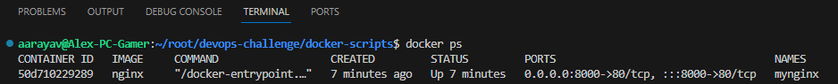
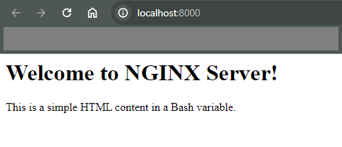
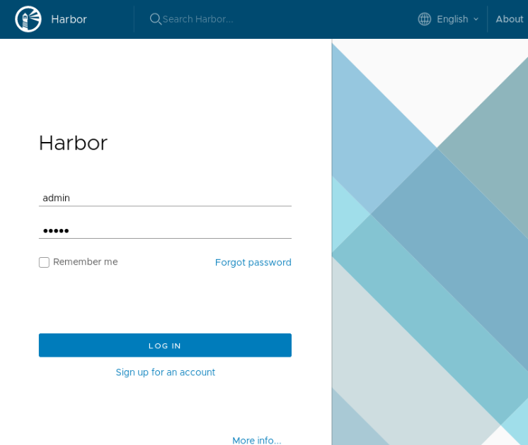

# Technical Challenge
### by Alexander Araya Vega

### 1. Nginx web server to expose files for download
- Prerequisites (Windows WSL - Ubuntu)
    - Install WSL, follow [Microsoft official documentation](https://techcommunity.microsoft.com/t5/windows-11/how-to-install-the-linux-windows-subsystem-in-windows-11/m-p/2701207/page/2)
    - Install Ubuntu OS <18.x.x from [Microsoft Store](https://www.microsoft.com/store/productId/9MTTCL66CPXJ?ocid=pdpshare)
    - In case of Docker manual installation, follow [Docker official documentation](https://docs.docker.com/engine/install/ubuntu/)
    - Install a Text editor, in this case is recommended Visual Studio Code. Follow [official docs](https://code.visualstudio.com/docs/setup/windows)

- INSTRUCTIONS
    - Clone the project locally in Ubuntu machine with Git command: ```git clone https://github.com/dev-aarayav/devops-challenge.git```
    - Open folder "docker-scripts" and use script ```nginx_setup.sh```
    - Run the following command before starting script: ```sudo apt-get update && sudo apt upgrade -y```
    - Grant execution access to script: ```$ chmod +x nginx_setup.sh```
    - Execution command for the script: ```$ ./nginx_setup.sh nginx```
    - Run the following command and check if the Docker container is running: ```$ docker ps```
     * NOTE: It should display an output like below:
     

    - Open a web browser and access http://localhost:8000 to see Nginx index web page running.
     * NOTE: It should display the following text in browser:
     

### 2. Run Harbor Resitry in Kubernetes cluster
- Prerequisites (Windows WSL - Ubuntu)
    - Install WSL, follow [official documentation](https://techcommunity.microsoft.com/t5/windows-11/how-to-install-the-linux-windows-subsystem-in-windows-11/m-p/2701207/page/2)
    - Install Ubuntu OS <18.x.x from [Microsoft Store](https://www.microsoft.com/store/productId/9MTTCL66CPXJ?ocid=pdpshare)
    - Minikube [installation](https://cursosdedesarrollo.com/2020/07/instalacion-de-kubernetes-minikube-en-ubuntu-20-04/) 
    - Minukube start [official documentation](https://minikube.sigs.k8s.io/docs/start/)
    - Install a Text editor, in this case is recommended Visual Studio Code. Follow [official docs](https://code.visualstudio.com/docs/setup/windows)

- INSTRUCTIONS
    - Clone the project locally in Ubuntu machine.
    - Open folder "k8s-scripts" use script ```k8s_harbor_deploy.sh```
    - Run the following command before starting script: ```sudo apt-get update && sudo apt upgrade -y```
    - Grant execution access to script: ```$ chmod +x k8s_harbor_deploy.sh```
    - Execution command for the script (No Arguments needed): ```$ ./nginx_setup.sh```
        *NOTE: This script contains the complete logic. It installs Docker, Minikube, K8s tools & Helm. Then it deploys Harbor with Helm into Minikube cluster.*

    *IMPORTANT NOTE*
    - Inside of directory ```additional-scripts``` you will find the following scripts:
        1. ```rm_k8s.sh```: If the installation goes wrong for any reason, this script removes K8s and minikube.
        2. ```get_helm.sh```: This script is to install Helm ONLY (But you can skip it because it's executed inside ```k8s_harbor_deploy.sh```).
        3. ```test_scrip```: It contains additional functions missing in principal script.

- INSTRUCTIONS: After Installation
    - After executing the script, follow the steps below to confirm that everything is running:
        1. Open in yor browser the following link: https://harbor.local.registry.com
            
        
        