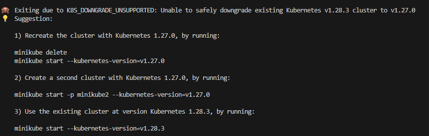
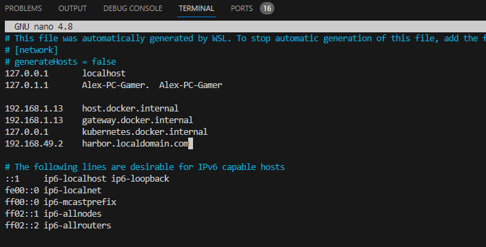

### Additional information of Kubernetes solution.

### Required commands to stop and clean up services after running your script to reset the environment:
- List all Helm releases across all namespaces (-A flag): ```helm list -A```
- Remove Helm Release (Harbor deployment): ```helm uninstall <release-name>```
- sudo rm $(which helm)
- rm -rf ~/.helm

# Stop and delete Minikube cluster (but still installed)
- Stop Minikube cluster: ```minikube stop```
- Delete Minikube cluster: ```minikube delete```

(ONLY IF IS NOT DEFAULT NAMESPACE)
- Get K8s Namespaces: ```kubectl get namespaces```
- Reset K8s Namespace: ```kubectl delete namespace <namespace-name>```

- List Docker images: ```docker images```
- Remove Docker Images: ```docker rmi <image-name>``

### Meaning of each Docker command flag (with VARIABLE):
- docker build -t "$IMAGE_NAME:$TAG" "$DIR_DCK": ```docker build -t <image-name>:<tag> <path-to-dockerfile>```
- docker tag "$IMAGE_NAME:$TAG" "$HARBOR_REGISTRY/$PROJECT_NAME/$IMAGE_NAME:$TAG": ```docker tag <image-name>:<tag> <harbor-registry>/<project>/<image-name>:<tag>```
- docker push "$HARBOR_REGISTRY/$PROJECT_NAME/$IMAGE_NAME:$TAG": ```docker push <harbor-registry>/<project>/<image-name>:<tag>```
- docker pull "$HARBOR_REGISTRY/$PROJECT_NAME/$IMAGE:$TAG": ```docker pull <harbor-registry>/<project>/<image-name>:<tag>```

### Explanation of multiple script commands:
1. ```IMAGE_EXISTS=$(docker pull localhost:5000/my-project/my-image:v1 2>&1 | grep -c "manifest unknown")```: 
    - Docker pull localhost:5000/my-project/my-image:v1: This part attempts to pull the specified image (my-image:v1) from the Harbor registry running at localhost:5000. The 2>&1 part at the end of the command redirects both standard output and standard error to the same stream.
    - grep -c "manifest unknown": The | (pipe) symbol takes the output from the previous command (docker pull) and passes it to grep, a command-line utility for searching patterns. -c in grep -c counts the number of lines that match the pattern provided. Here, grep -c "manifest unknown" searches for the phrase "manifest unknown" in the output of the docker pull command.
    - Putting it together: The command docker pull localhost:5000/my-project/my-image:v1 2>&1 | grep -c "manifest unknown" attempts to pull the image my-image:v1 from the specified Harbor registry. If the image does not exist in the registry, Docker returns an error with the message "manifest unknown." The grep -c command counts how many times this error message appears in the output.
    - So, the variable IMAGE_EXISTS will contain the count of occurrences of "manifest unknown" in the output of docker pull. If the image doesn't exist in the registry, IMAGE_EXISTS will be 1 (indicating one occurrence of "manifest unknown"), and if the image does exist, IMAGE_EXISTS will be 0 (indicating no occurrences).
2. ```helm show values harbor/harbor```:
    - Command used to display all the Harbor default values for configuration.
    - The output can be used as reference to create own ```values.yaml``` and create a Helm Chart.
3. ```RESPONSE=$(curl -s -o /dev/null -w "%{http_code}" $HARBOR_URL) # Validation```
    - RESPONSE=: This part initializes the variable where the HTTP response code will be stored.
    - ```$(...)```: This is command substitution in Bash. It allows the output of a command or expression to replace the command itself. In this case, it's wrapping the curl command.
    - ```curl```: This is a command-line tool used for transferring data using various protocols. Here, it's used to perform an HTTP request.
    - ```-s:``` This flag tells curl to work in silent mode, meaning it won't show progress or error messages.
    - ```-o /dev/null```: This flag tells curl to write the output to /dev/null, a special file that discards all data written to it. Essentially, it's used here to suppress the output (like the response body) from being displayed.
    - ```-w "%{http_code}"```: This flag tells curl to print the HTTP response code (%{http_code}) to standard output after the request is made. It specifies the format of the output to just the HTTP response code.
    - ```$HARBOR_URL```: This variable holds the URL to which the curl command will send the HTTP request. It's the Harbor service URL constructed earlier.

### Namespaces available in Minikube cluster
- default: This is the default namespace where resources are created if no other namespace is specified.
- kube-node-lease: This namespace holds node lease objects that nodes use to declare their health status to the control plane.
- kube-public: This namespace contains resources that should be made available to all users, typically used for cluster information.
- kube-system: This namespace contains Kubernetes system resources and control plane components like kube-dns, kube-proxy, etc.

### Pods available for Harbor namespace (default)
- harbor-core: Core Harbor services
- harbor-database: Harbor's database service
- harbor-jobservice: Job service responsible for background jobs in Harbor
- harbor-portal: The Harbor web portal interface
- harbor-redis: Redis service used by Harbor
- harbor-registry: Registry service where Docker images are stored
- harbor-trivy: Security scanner service (Trivy) for vulnerabilities in images

Each of these pods represents a different component or service within the Harbor deployment, contributing to its functionality as a container registry and image management system.

### Commands to fix an issue with unsupported version of K8s



### Harbor troubleshooting
Use command ```helm fetch harbor/harbor --untar``` to download/unzip all configuration files of Harbor.

1. Ingress: The Ingress configuration in the values.yaml file for Harbor controls how Harbor is exposed to external traffic through Ingress in Kubernetes.
    - use command ```minikube ip``` to get Minikube k8s cluster IP.
    - Use command ```sudo nano /etc/hosts``` to add at the bottom a custom localhost name line with Minikube cluster IP ```192.168.49.2```.
    - Use localhost name ```harbor.local.registry.com``` and setup in Harbor ```values.yaml``` Ingress configuration. 

    

2. IngressClassName: is an attribute used to specify the class name of an Ingress controller in Kubernetes. It's part of the Ingress resource configuration and is used to associate an Ingress resource with a specific Ingress controller. In this case was setup ```nginx``` as the ClassName.

3. Added the following annotation ```nginx.org/client-max-body-size: "0"``` and is used to set the maximum allowed size of the client request body in an NGINX-based Ingress controller configuration in Kubernetes.  Setting it to a specific value (in this case, "0") implies there is no size limit enforced by NGINX itself. A value of "0" means "unlimited" or "no restriction" on the client request body size. In this case is helpful so that we can upload large docker images without any size limit issue.



4. Annotation externalURL: Use the same hostname as in step 1 Ingress configuration.


5. Persistance configuration: 

6. Change ```harborAdminPassword``` annotation value with your custom password. In this case the password will be ```Alex1234``` and the user ```admin```

7. Add a DNS line in file "resolv.conf" located in /etc/resolv.conf where you should add the Minikube IP to be part of the resolve DNS available.


# kubectl commands
- ```kubectl get pvc```: This should be executed for a namespace in specific to get all the volumes setup.
- ```kubectl get svc```: Shows ClusterIP that has the Harbor registry service running on port 5000TCP, 8080/TCP
- ```kubectl get ingress```: Shows the Ingress created to access Harbor using the localhostname setup in /etc/hosts path.
- ```kubectl describe secret <secret-name>```: Check the details of this secret and its content.
- ```minikube addons enable ingress```: To enable the NGINX Ingress controller.
- ```curl --resolve "harbor.local.registry.com:80:$(minikube ip)" -i http://harbor.local.registry.com```: curl is makng HTTP requests to the localhost name at port 80 defined in Helm Chart and the flag ```--resolve``` to override the DNS lookup with a specific IP address for the given hostname.

### Resources
- Kubernetes documentation about Ingress https://kubernetes.io/docs/tasks/access-application-cluster/ingress-minikube/
- Minikube solution for Ingress access https://minikube.sigs.k8s.io/docs/handbook/addons/ingress-dns/

# ./test2.sh /home/aarayav/root/devops-challenge/k8s-scripts/nginx_server/ nginx-image nginx-project